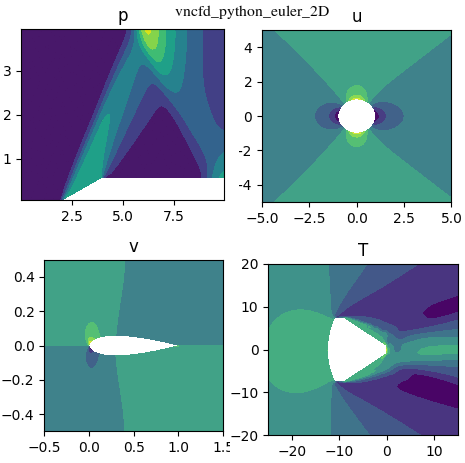

# CFD Notebook - Thực hành CFD với Python!

Phần 3 `Thực hành CFD với Python!` sẽ xoay quanh việc xây dựng chương trình giải hệ phương trình Euler 2D. Việc chuyển từ 1D sang 2D là một bước đi quan trọng và thú vị. Phần này tập trung giải thích cấu trúc chương trình, cấu trúc dữ liệu, nhiều phần lý thuyết chỉ dừng lại ở việc giới thiệu tài liệu để bạn đọc tự tham khảo. Chương trình sử dụng **phương pháp thể tích hữu hạn; phương pháp tính dòng Godunov, Roe; sơ đồ hiện, bậc một theo thời gian; tái cấu trúc nghiệm bậc một Godunov, lưới có cấu trúc** và được viết bằng ngôn ngữ `python2.7`. Ta cũng sẽ làm quen với phần mềm `ParaView` để biểu diễn và xử lý kết quả. Các bài toán ví dụ bao gồm: **dòng chảy trên âm qua dốc; dòng chảy bao hình trụ, NACA profile và tàu vũ trụ Crew Dragon**.

**Danh sách các bài học:**
* [Bài 18](https://nbviewer.jupyter.org/github/SangVn/CFD_Notebook_P3/blob/master/Bai_18.ipynb) Mở đầu, hệ phương trình Euler hai chiều, phương pháp giải

* [Bài 19](https://nbviewer.jupyter.org/github/SangVn/CFD_Notebook_P3/blob/master/Bai_19.ipynb) Lưới có cấu trúc, bài toán dòng chảy trên âm qua dốc 

* [Bài 20](https://nbviewer.jupyter.org/github/SangVn/CFD_Notebook_P3/blob/master/Bai_20.ipynb) Cấu trúc dữ liệu Cells, Sides

* [Bài 21](https://nbviewer.jupyter.org/github/SangVn/CFD_Notebook_P3/blob/master/Bai_21.ipynb) Điều kiện biên supersonic, wall

* [Bài 22](https://nbviewer.jupyter.org/github/SangVn/CFD_Notebook_P3/blob/master/Bai_22.ipynb) Phương pháp tính dòng qua mặt, xử lý kết quả, module solver

* [Bài 23](https://nbviewer.jupyter.org/github/SangVn/CFD_Notebook_P3/blob/master/Bai_23.ipynb) Thiết lập module setup, run. Tính bài toán dòng chảy trên âm qua dốc

* [Bài 24](https://nbviewer.jupyter.org/github/SangVn/CFD_Notebook_P3/blob/master/Bai_24.ipynb) Bài toán dòng chảy quanh hình trụ, NACA0012, Crew Dragon. Điều kiện biên joint, farfield

**Tài liệu tham khảo:**

* Eleuterio F. Toro `Riemann Solvers and Numerical Methods for Fluid Dynamics`
* Randall J. Leveque `Finite-Volume Methods for Hyperbolic Problems`
* H. K. Versteeg, W. Malalasekera `An introduction to Computational Fluid Dynamics. The Finite Volume Method`
* Katake Masatsuka `I do like CFD. Governing Equations and Exact Solutions`
* F. Moukalled, L. Mangani, M. Darwish `The Finite Volume Method in Computational Fluid Dynamics. An Advanced Introduction with OpenFOAM and Matlab`

